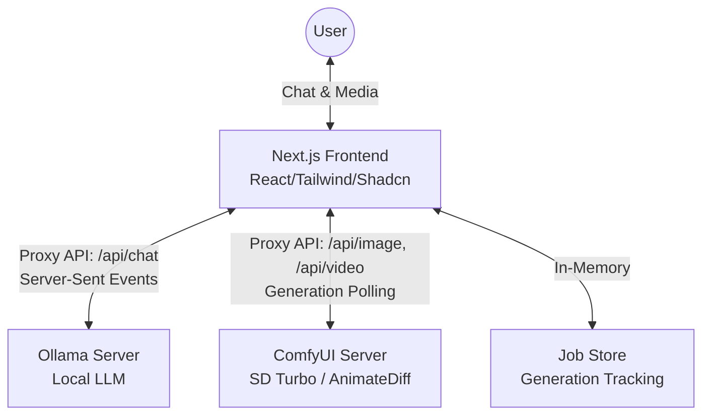

# Kepler AI

A full-stack, local-first ChatGPT-like web application built with Next.js 14, Tailwind CSS, and Shadcn UI. Kepler AI provides not just intelligent text conversations via local LLMs (Ollama) but also features deep integration with ComfyUI for seamless, prompt-driven AI image and video generation natively in the chat.

## Features

- 🚀 **Real-time Streaming**: Token-by-token streaming responses from Ollama local LLMs.
- 💬 **Modern Chat Interface**: Sleek, responsive, ChatGPT-like UI equipped with markdown and syntax highlighting.
- 🎨 **Native Image Generation**: Natural language detection triggers text-to-image generation powered by ComfyUI (SD Turbo / SD 1.5).
- 🎥 **Native Video Generation**: Seamless text-to-video creation powered by ComfyUI (AnimateDiff).
- ⚡ **Full-Stack Next.js**: Built with Next.js 14 App Router, TypeScript, and server-side API routes for robust proxying.
- 🛠️ **Local-First Architecture**: Designed to run entirely locally with zero cloud dependencies using your own GPU resources.
- 📱 **Responsive**: Fully responsive design for desktop and mobile interactions.

## System Architecture

Kepler AI is built upon a microservice-like local architecture, decoupling the frontend from the heavy AI generation workloads:



### Components

1. **Frontend (Next.js)**: Orchestrates the user interface, renders markdown, handles real-time response streaming, and polls for media generation statuses (`MediaDisplay.tsx`).
2. **Text Generation (Ollama)**: Local LLM service (`qwen2.5:latest` by default) processing conversational context and understanding natural requests to generate media.
3. **Media Generation (ComfyUI)**: A local ComfyUI instance running on port 8188 handling text-to-image and text-to-video capabilities seamlessly.

## Prerequisites

- Node.js 18+ and npm
- [Ollama](https://ollama.ai) installed and running (default: http://localhost:11434)
- A model installed in Ollama (e.g., `qwen2.5`)
- [ComfyUI](https://github.com/comfyanonymous/ComfyUI) for image/video generation capabilities.

## Setup & Running

**1. Install dependencies:**
```bash
npm install
```

**2. Configure environment variables:**
Create or update `.env.local`:
```env
LLM_API_URL=http://localhost:11434
COMFYUI_URL=http://127.0.0.1:8188
```

**3. Launch Services:**

We provide convenient batch scripts to run all localized services together:
```bash
# Starts Ollama, ComfyUI, and Next.js all at once
START_ALL_SERVICES.bat
```

Alternatively, run Next.js standalone:
```bash
npm run dev
```
Navigate to [http://localhost:3000](http://localhost:3000)

## Project Structure

```text
root/
 ├── app/
 │    ├── api/                # Next.js API Routes (Proxying to AI Servers)
 │    │     ├── chat/         # /api/chat - Proxies Ollama SSE completions
 │    │     ├── image/        # /api/image - ComfyUI Text-to-Image Generation
 │    │     └── video/        # /api/video - ComfyUI Text-to-Video Generation
 │    ├── chat/               # Main Chat application page
 │    └── ...
 ├── components/              # Shadcn UI and custom components
 │    ├── ChatMessage.tsx     # Message bubbles 
 │    ├── MediaDisplay.tsx    # Renders pending/completed media generation jobs
 │    └── ...
 ├── lib/
 │    ├── llm.ts              # LLM client streaming utility
 │    ├── comfyui.ts          # ComfyUI API integration (Workflows logic)
 │    ├── job-store.ts        # In-memory store handling generation polling
 │    └── generation.ts       # Generation intent parser & frontend hooks
 ├── START_ALL_SERVICES.bat   # Startup Script
 └── START_GENERATION_SERVICES.bat # Startup Script for ComfyUI
```

## How It Works (Media Generation Workflow)

1. The user asks "Generate an image of a galaxy" in the chat.
2. `lib/generation.ts` parses the prompt to automatically deduce the user intent or explicitly looks for `/image` or `/video` commands.
3. A background API request goes to `/api/image` which triggers a targeted workflow on the local ComfyUI instance via `lib/comfyui.ts`.
4. An immediate placeholder message displaying "Generating image..." alongside a loader (`MediaDisplay.tsx`) appears.
5. The frontend incrementally polls the `/api/image/status` endpoint to check if ComfyUI has completed the task and retrieved the media URL.
6. The media drops seamlessly into the message stream upon completion.

## Customization

### Change Model Name
Edit `app/api/chat/route.ts` and modify the `model` field. Also, ensure the model is pulled down via Ollama:
```bash
ollama pull <your-model-name>
```

### Theming
The app relies on Tailwind CSS with Shadcn UI. Modify the variables in `app/globals.css` and the config in `tailwind.config.js` to change the system aesthetics.

## 🚀 Deployment

### Option 1: Cloudflare Tunnel (FREE - Recommended for Testing)
Deploy using Cloudflare Tunnel to expose your local Ollama/ComfyUI workloads:
- See `QUICK_DEPLOY_CLOUDFLARE.md` for a 5-minute setup.
- Perfect for testing; keeps inference safely and freely on your local hardware.

### Option 2: Cloud GPU (Production)
Deploy vLLM/ComfyUI on a cloud GPU instance for 24/7 generation availability.
- See `DEPLOYMENT.md` for our guide.

---

## License
MIT
